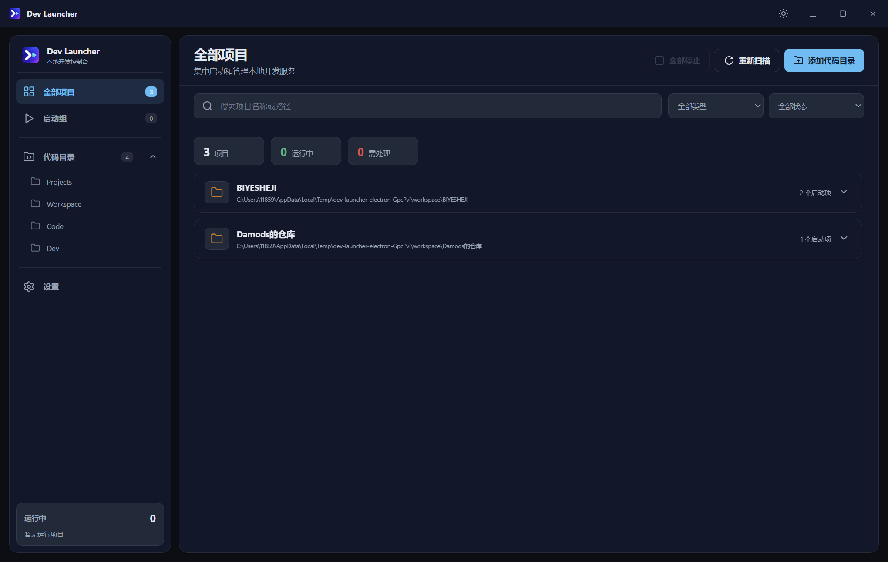
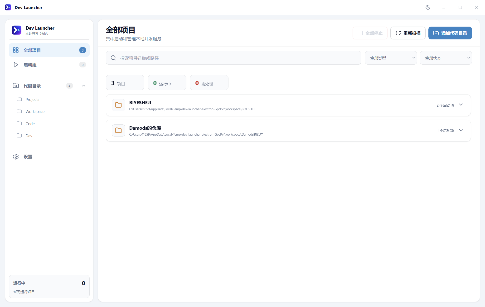

# Dev Launcher

[English](README_EN.md)

> A Windows desktop app that auto-discovers and one-click launches local Java & frontend projects — no need to open your IDE first.

[](LICENSE)
[](https://github.com/Damods/dev-launcher/releases)
[](https://github.com/Damods/dev-launcher)

Dev Launcher 是一款 Windows 桌面应用，用来自动发现并一键启动本地 Maven、Gradle 和前端项目，无需先打开 IDEA。

应用包含专属 Windows 图标，用于主窗口、软件品牌区、任务栏、系统托盘、桌面快捷方式和安装程序。

## 界面预览 | Screenshots

深色 / 浅色主题可随时切换：

| 深色主题 | 浅色主题 |
|:---:|:---:|
|  |  |

## 功能特性 | Features

- 添加一个或多个代码根目录并在后台递归扫描
- 识别 Maven、Gradle、Spring Boot、npm、pnpm 和 Yarn 项目
- 优先使用项目内的 Maven/Gradle Wrapper，并根据锁文件选择前端包管理器
- 编辑启动命令、参数、工作目录、环境变量、固定网页地址和日志编码
- 并行启动多个项目，实时查看日志，停止完整子进程树
- 左侧按项目区分独立日志入口，每个入口只启动或停止对应项目
- 左侧和全部项目页按启动项所在的直接父文件夹分类；同一父文件夹中的前后端项目会归入同一组
- 启动项目后自动打开该项目的实时日志控制台，不混入其他项目输出
- 自动提取日志中的 HTTP/HTTPS 地址，手动复制或打开
- 日志正文中的 HTTP/HTTPS 地址可直接点击并用默认浏览器打开
- 创建前后端启动组并一键启动或停止
- 关闭窗口时：无运行中的项目直接退出；有运行中的项目弹窗提示阻止误关，避免遗留子进程，可从系统托盘快速恢复窗口
- 本地持久化配置，环境变量使用 Windows 当前用户范围加密

## 安装 | Installation

1. 前往 [Releases](https://github.com/Damods/dev-launcher/releases) 下载最新版 `Dev Launcher Setup <版本>.exe`。
2. 双击运行安装程序，按向导完成安装。
3. 打开 Dev Launcher，添加你的代码目录即可使用。

## 开发运行 | Development

需要 Windows 和 Node.js。首次使用先安装依赖：

```powershell
npm install
npm start
```

## 测试与打包 | Test & Build

```powershell
npm test       # 运行单元测试
npm run dist   # 打包 Windows NSIS 安装包（生成在 release 目录）
```

## 使用说明 | Usage

1. 点击“添加代码目录”，选择存放项目的根目录。
2. 扫描完成后，在项目卡片上点击“启动”。
3. 如果项目显示“需要配置”，点击编辑按钮补充正确的启动命令和参数。
4. 点击项目卡片查看实时日志和识别出的网页地址。
5. 需要同时启动前后端时，在“启动组”中创建组合。

Dev Launcher 不会自动安装或修改 Java、Node.js、Maven、Gradle 等本地环境。

## 参与贡献 | Contributing

欢迎 Issue 和 Pull Request，详情请阅读 [CONTRIBUTING.md](CONTRIBUTING.md)。

## 许可证 | License

[MIT](LICENSE) © 2026 Damods
